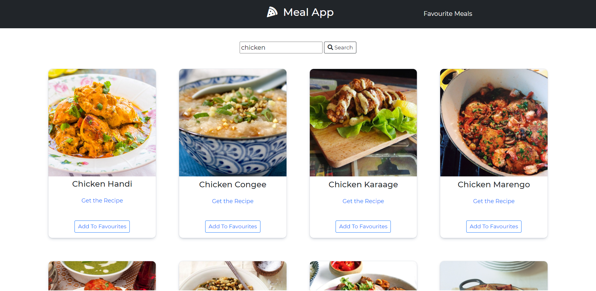
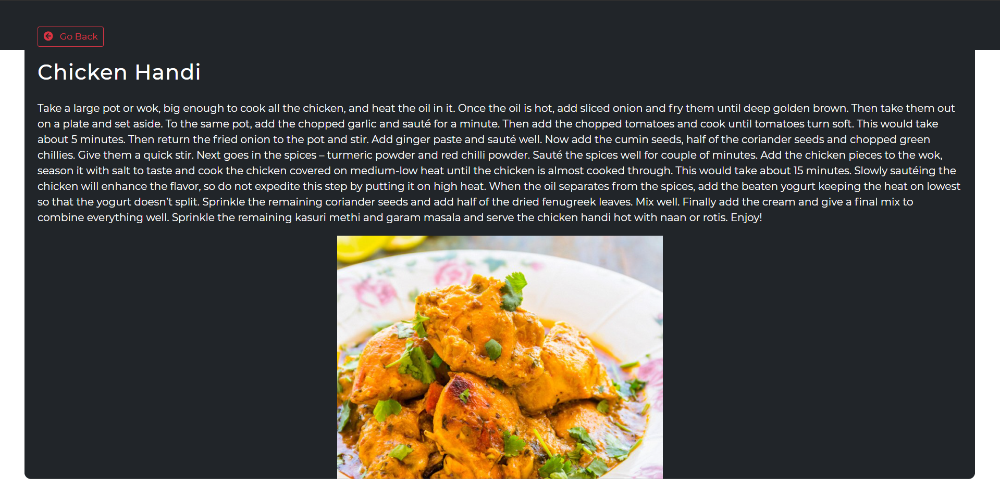
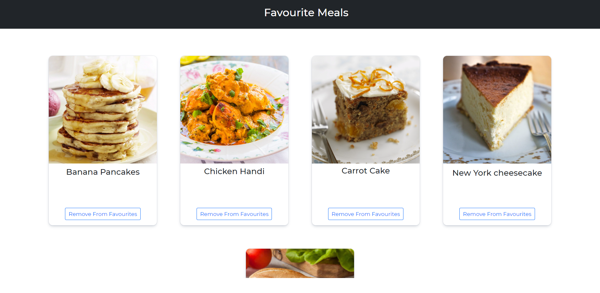

# Meals App

An app that allows users to search for a meal and get the recipe for that meal.[click here to view the app](https://mr-kotresh-gb.github.io/Meals-app/)

## App Interface

## Features

- Search for any meal
- Get recipe for that particular meal and link to a video
- Add/remove meals from favourites

## API

API used for this project: <https://www.themealdb.com/api.php>

## Tech Used

- [HTML](https://en.wikipedia.org/wiki/HTML)
- [CSS](https://en.wikipedia.org/wiki/CSS)
- [Vanilla Javascript](https://www.javascript.com/)
- [Bootstrap](https://getbootstrap.com/)
